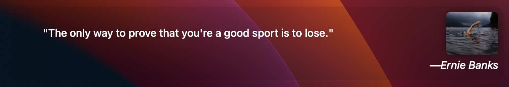

# Quote of the Day

This a widget for [Übersïcht](http://tracesof.net/uebersicht/) that displays a random quote from [They Said So Quotes API](https://theysaidso.com/api/).

## Installation

Download the quote-of-the-day.widget.zip and unzip it to your widgets folder (default: ~/Library/Application Support/Übersicht/widgets).

## Preview



## Settings

### Refresh time

The default is not to update. Change it if necessary.

```js
    // the refresh frequency in milliseconds
    // 21600000 = every 6h
    // 43200000 = every 12h
    // 86400000 = every 24h / day
    export const refreshFrequency = false;
````

### Quote

The plugin use the public API no need for a key, the is retrieve from a category. The default is **randomly**.

### categories

A category is automatically set when the widget is startup.
Edit the file to set your desired categories
here are the predefined categories.

```js
    // If you want a particular category to always be displayed,
    // configure as follows.
    function getCategory(categories) {
        // return categories[Math.floor(Math.random() * (categories.length))];
        return { name: 'art' };
    }
````

### Appearance

For white backgrounds, uncomment this line in the css class, increase the alpha to your liking:

```css
    background: rgba(0,0,0,0.5) /*will be dark enough to be readable.*/
````

**Note**: There is now minimum background color by default.

```css
    background: rgba(9, 10, 13, 0.10);
````

If you use a different background for each mode like Darkish wallpaper when in Dark mode the text-color will be white & the opposite when using a white like wallpaper in Light mode

The following is an example.

```css
    @media(prefers-color-scheme: light) {
        color: #444444;

        .author {
            color: #666666;
        }
    }
````

Edit the position by changing these settings:

```css
    bottom: 80px;
    left: 0; 
````

To change the width of the container change this part according to your need

```css
    width: 50vw;
````

#### Quote image

Comment line ** to hide the image

```html
    
````

## Disclaimer

I am not a react developer so, the widget might not be optimize I just edit the default file and throw in some Vanilla JavaScript.
~~I use localStorage to limit the amount of request to the end point and to have the quote even when the network is down.~~
